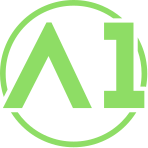
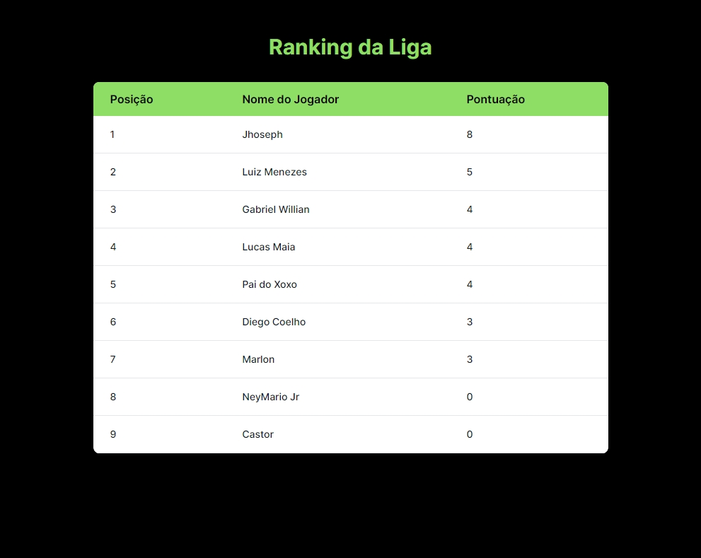

<p align="center">
  

<h1 align="center">
    
</h1>

<br>

## 🧪 Tecnologias

Esse projeto foi desenvolvido com as seguintes tecnologias:

- [Laravel](https://laravel.com/)
- [Tailwindcss](https://tailwindcss.com/)

## 🚀 Como executar

Clone o projeto e acesse a pasta do mesmo.

```bash
$ git clone https://github.com/gabrielgws/Liga-A1.git
$ cd Liga-A1
```

Para iniciá-lo, siga os passos abaixo:
```bash
# Instalar as dependências
$ composer install

# Configurar o arquivo .env
$ cp .env.example .env

# Gere uma chave da aplicação
$ php artisan key:generate

# Execute as migrações
$ php artisan migrate

# Iniciar o servidor de Desenvolvimento
$ php artisan serve
```
O app estará disponível no seu browser pelo endereço http://127.0.0.1:8000/.

## 💻 Projeto

Desenvolvimento de uma plataforma de uma liga, de forma gerenciável:
- Cadastro de novos usuários;
- Adicionar ou remover usuário a liga;
- Gerenciar regras da liga: Adicionar, remover ou editar;
- Aplicar regras a cada player, podendo adicionar ou remover regra;
- Página de usuário aonde poderá atualizar suas informações.

## 🔖 Layout

Direitos gabrielgws.dev

## 📝 License

---

Feito com 💜 by gabrielgws :rocket:	
